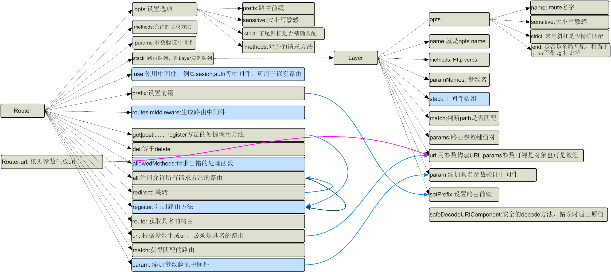
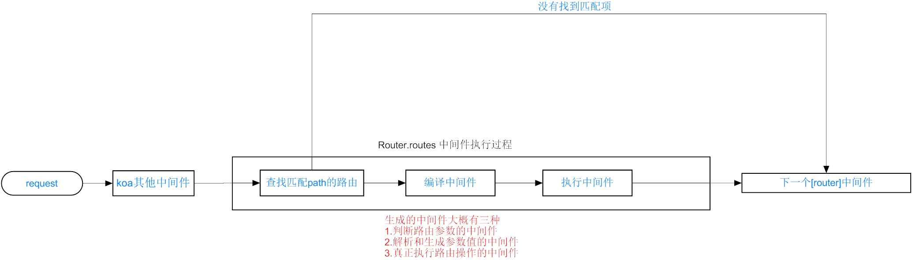
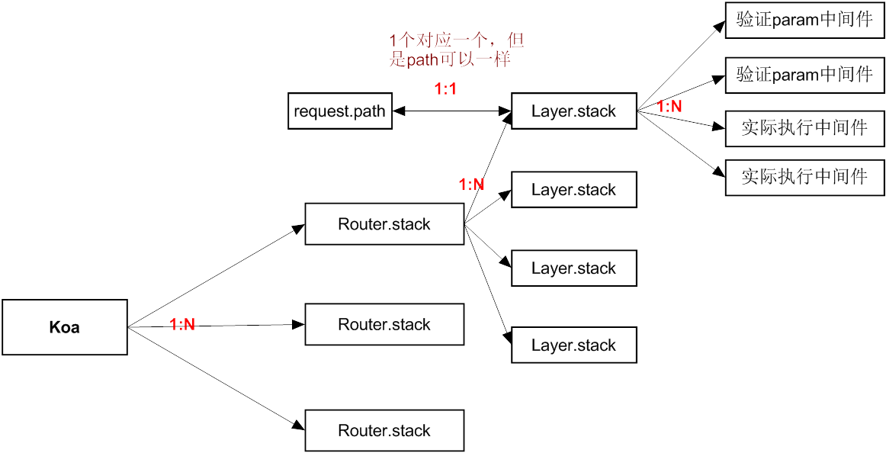

koa-router源码地址是 [koa-router](https://github.com/alexmingoia/koa-router/tree/master/)   
当前解读版本为7.2.1    

## 关系图
**代码结构图**     

**执行流程图**

**关系对应图**


## Router方法和属性浅析

#### methods.forEach
注册注册路由的方法,结果就是Router的原型上面多了get,post,delete,del等注册路由的方法    
代码使用的时候 r1.get就是这么来的    
```javascript
r1.get('/test1/:id', function (ctx, next) {
  console.log('test1 :1')
  next()
}, function (ctx, next) {
  console.log('test1:2')
})
```
#### Router.prototype.del
等同于 Router.prototype.delete

#### Router.prototype.use 
注册中间件，支持形式多种多样   
看着这么多，其实就两种中间件，
* 普通中间件
* router.routes()返回的中间件      

重点就是router.routes()返回的这种件，需要的前缀，参数验中间件做一些处理
```javascript
  router.use(function (ctx, next) {
    ctx.foo = 'baz';
    return next();
  });
  router.use('/foo/bar', function (ctx, next) {
    ctx.foo = 'foo';
    return next();
  });
  router.use('/foo', subrouter.routes());
  router.use(['/foo', '/bar'], function (ctx, next) {
      ctx.foo = 'foo';
      ctx.bar = 'bar';
      return next();
    });
  parentRouter.use('/parent-route', function (ctx, next) {
    ctx.n = ctx.n ? (ctx.n + 1) : 1;
    return next();
  }, nestedRouter.routes());

```
#### Router.prototype.prefix 
给router实例添加前缀，前缀可以是包含参数的
```javascript
  router.prefix('/things/:thing_id')
```
#### Router.prototype.routes = Router.prototype.middleware
返回中间件，    
中间执行的时候，会根据path获取满足匹配条件的路由(Layer),然后根据每个Layer生成一个解析参数值的中间，这就是为什么我们在ctx.params能得到参数值    
最核心的代码如下
```javascript
    layerChain = matchedLayers.reduce(function(memo, layer) {
      memo.push(function(ctx, next) {
        ctx.captures = layer.captures(path, ctx.captures);
        ctx.params = layer.params(path, ctx.captures, ctx.params);
        return next();
      });
      return memo.concat(layer.stack);
    }, []);
    return compose(layerChain)(ctx, next);
```
matchedLayers是匹配的Layer或者说一条路由信息，同一个路径同样的方法也是会生成两条记录的,如下同样的注册，会生成两个不同路由(Layer),哪怕信息一模一样   
```javascript
r1.get('/test1', function (ctx, next) {
  console.log('test1 :1')
  next()
})

r1.get('/test1', function (ctx, next) {
  console.log('test1 :2')
  next()
})
```
matchedLayers.reduce没执行一次，是生成两个中间件，   
一个是参数解析的中间件,这就是为什么你可以通过ctx.params取值到路由参数了      
```javascript 
function(ctx, next) {
        ctx.captures = layer.captures(path, ctx.captures);
        ctx.params = layer.params(path, ctx.captures, ctx.params);
        return next();
      }
```
另外一个才是实际路由匹配的执行方法,上面的demo就是   
```javascript
function (ctx, next) {
  console.log('test1 :1')
  next()
}
```

#### Router.prototype.allowedMethods
*此方法执行很靠后，在他后面注册的中间件执行完毕后才执行*    
生成一个中间件，作用是定义路由没匹配到，方法未允许，方法未实现等的返回信息
```javascript
  app.use(router.routes());
  app.use(router.allowedMethods({
    throw: true,
    notImplemented: () => new Boom.notImplemented(),
    methodNotAllowed: () => new Boom.methodNotAllowed()
  }));
```

#### Router.prototype.all
注册一个路由，允许所有的get,post等方法访问

#### Router.prototype.redirect 
跳转，原理就是注册了一个路由，用ctx.redirect来实现跳转
```javascript
router.redirect('/login', 'sign-in');
```
等同于
```javascript
router.all('/login', function (ctx) {
  ctx.redirect('/sign-in');
  ctx.status = 301;
});
```
#### Router.prototype.register
核心方法之一，注册中间件    
Router.prototype.all,methods.forEach等底层都是调用这个家伙实现的     
Router.prototype.use也依据情况会调用

#### Router.prototype.route
查找具名的route(Layer)
#### Router.prototype.url 
生成url，可以传参
```javascript
router.get('user', '/users/:id', function (ctx, next) {
  // ...
});
router.url('user', 3);
// => "/users/3"
router.url('user', { id: 3 });
// => "/users/3"
router.use(function (ctx, next) {
  // redirect to named route
  ctx.redirect(ctx.router.url('sign-in'));
})
```
#### Router.prototype.match
获得匹配的路由(Layer),以path和method来过滤的   
router.routes返回的中间件底层就是通过他来确认请求应该进入哪些路由的
#### Router.prototype.param 
添加参数验证中间件，这个需要结合Layer.prototype.param 一起来理解   
```javascript
Router.prototype.param = function (param, middleware) {
  this.params[param] = middleware;
  this.stack.forEach(function (route) {
    route.param(param, middleware); 
  });
  return this;
};

Layer.prototype.param = function (param, fn) {
  var stack = this.stack;
  var params = this.paramNames;
  // 构建参数验证中间件
  var middleware = function (ctx, next) {
    return fn.call(this, ctx.params[param], ctx, next);
  };
  middleware.param = param;

  var names = params.map(function (p) {
    return p.name;
  });

  var x = names.indexOf(param);
  if (x > -1) {
    // iterate through the stack, to figure out where to place the handler fn
    stack.some(function (fn, i) {
      // param handlers are always first, so when we find an fn w/o a param property, stop here
      // if the param handler at this part of the stack comes after the one we are adding, stop here
      // fn.param 作为判断是不是参数验证中间件的标志
      // 如果不是参数验证中间件，或者参数验证中间件需要验证的参数在我之后，插入参数验证中间件
      // 比如说path是这样的 /user/:id/posts/:postid, 那么id参数验证中间件应该在postid参数之前
      // 简单说，确保参数按照顺序被验证
      if (!fn.param || names.indexOf(fn.param) > x) {
        // inject this param handler right before the current item
        stack.splice(i, 0, middleware);
        return true; // then break the loop
      }
    });
  }

  return this;
};
```

更多细节请直接看带备注的源码吧，写东西真累啊！
[Router](router.md)
[Layer](layer.md)

## Layer方法和属性浅析
#### Layer.prototype.match
path是否匹配路由
#### Layer.prototype.params
获得路由参数键值对
#### Layer.prototype.captures 
获得路由参数的值
#### Layer.prototype.url 
用参数构建URL,params参数可视是对象也可是数组
#### Layer.prototype.param 
添加参数验证中间件
#### Layer.prototype.setPrefix
设置前缀
#### safeDecodeURIComponent
decodeURIComponent错误时返回原值


>[koa-router 源码解析 - segmentfault](https://segmentfault.com/a/1190000007468233)   
>[解析Koa-Router，迈入Web次时代第一步（上）](http://cnodejs.org/topic/578a19866d3f2b2014113edd)    
>[Koa-Router 源码解析下 -CNode](http://cnodejs.org/topic/5792c2222d740f7c26637e08)   
>[koa-router源码解读](https://github.com/dwqs/blog/issues/8)   

>[Koa-router 优先级问题](https://segmentfault.com/a/1190000009635991)

>[Path-to-RegExp 使用](https://www.ctolib.com/topics-116169.html)